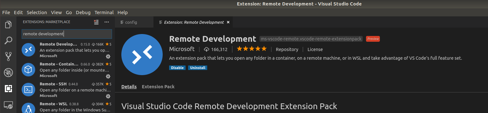
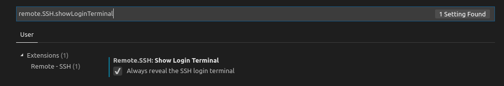
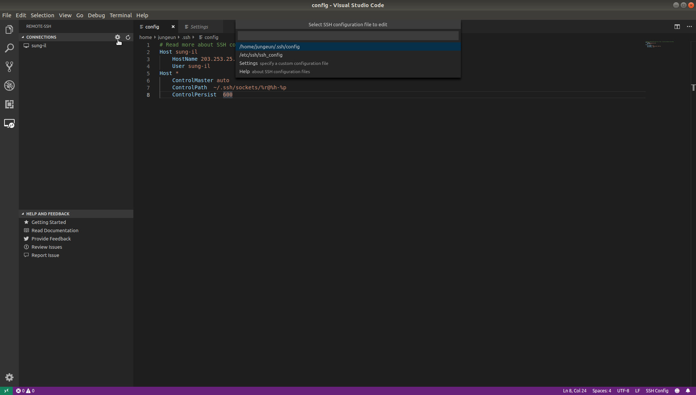
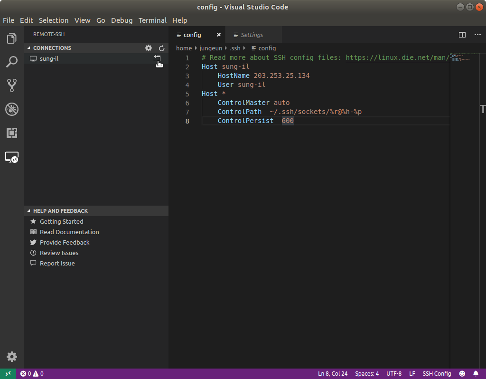

# VSCode에서 SSH를 사용한 Remote 개발

<https://code.visualstudio.com/docs/remote/ssh> 글을 참고하였습니다.

환경 : ubuntu 18.04


### 설치

1. local에 OpenSSH client 설치하기

   ```
   $ sudo apt-get install openssh-client
   ```
   server에 OpenSSH server 설치하기

   ```
   $ sudo apt-get install openssh-server
   ```

   

2. VSCode 설치하기

   

3. VSCode에서 Remote Development extension 설치(2가지 방법)

   - vscode에서 Remote Development 직접 찾아서 설치

   

   - Code Quick Open (```Ctrl+P```) 열어서 다음을 입력

     ```
     ext install ms-vscode-remote.vscode-remote-extensionpack
     ```

   

4. 원격 호스트에 로그인 할 때 비밀번호를 입력해야 한다면 ControlMaster사용하기

   - Setting (```Ctrl+,```)에서 remote.SSH.showLoginTerminal을 enable하기

     

     

   - SSH config 파일(~/.ssh/config)에 다음을 추가하기

     ```
     Host *
         ControlMaster auto
         ControlPath  ~/.ssh/sockets/%r@%h-%p
         ControlPersist  600
     ```

     vscode의 왼쪽 툴바의 Extention버튼 밑에 있는 Remote-SSH버튼 누르고 connection의 configure버튼 누르면 됨(하단 화면 참고)

     

     

   - terminal에서 ```mkdir -p ~/.ssh/sockets```커맨드로 ControlMaster를 위한 디렉터리 생성

     ControlMaster를 사용하면 비밀번호를 한번만 입력하면 된다.

   

### Remote host에 연결하기

1. local의 public SSH 키를 host의 ```~/.ssh/authorized_keys```에 추가하기

   - ```ssh-agent sh -c 'ssh-add; ssh-add -L'```로 key 있는지 확인

     없으면 ```ssh-keygen```로 키발급먼저 하기

     

   - 발급한 키를 host에 보내기

     ```
     $ sudo ssh-copy-id user@host-ip
     ```

     여기서 user는 host의 username이다. 예를들어 terminal에서 ```sudo ssh user@host-ip```로 쓰는 경우 위와 같이 커맨드입력하면 된다.

     

   - host의 ~/.ssh/authorized_keys에 잘 보내졌는지 확인

     

2.  local의 ~/.ssh/config파일에 remote추가하기

   ```
   HOST user						# host의 name
   	HostName 203.253.25.xxx		# host의 ip
   	User user					# host의 username
   ```

   

3.  설정이 바로 반영되면 remote명단에 host에 connect

   바로 반영이 되지 않으면 껐다 켜보기

   

   연결 후 비밀번호 입력하면 SSH host에 Connection됨


### Tip

혹시 도중에 permission오류가 난 경우 다음을 해보기

[Local] 에서

```
$ chmod 700 ~/.ssh
$ chmod 600 ~/.ssh/config
$ chmod 600 ~/.ssh/id_rsa.pub
$ chmod 600 /path/to/key/file    # 다른 key file이 있다면
```

[Host] 에서

```
$ chmod 700 ~/.ssh
$ chmod 600 ~/.ssh/authorized_keys
```

