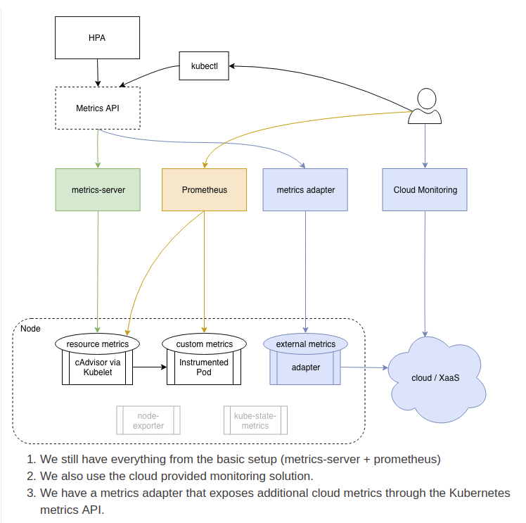
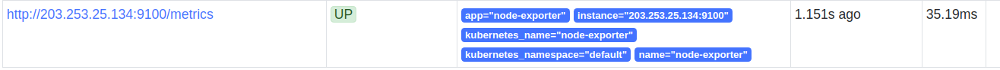

# Node-exporter와 Kube-state-metrics 추가하기

K8s 자원정보와 Daemon set, Deployments, Replica 등 다양한 정보를 얻기 위해선 Node-exporter와 Kube-state-metrics와 cAdvisor가 필요하다. cAdvisor는 Prometheus를 설치할때 같이 설치되므로 기존에 운영되는 k8s 클러스터에 Node-exporter와 Kube-state-metrics를 추가해 본다.

[참고]  Node 정보를 가져오는 과정




- Node-exporter

  아래의 yaml파일을 저장한다.

  ```
  apiVersion: v1
    kind: Service
    metadata:
      annotations:
        prometheus.io/scrape: 'true'
      labels:
        app: node-exporter
        name: node-exporter
      name: node-exporter
    spec:
      clusterIP: None
      ports:
      - name: scrape
        port: 9100
        protocol: TCP
      selector:
        app: node-exporter
      type: ClusterIP
  ---
  apiVersion: extensions/v1beta1
    kind: DaemonSet
    metadata:
      name: node-exporter
    spec:
      template:
        metadata:
          labels:
            app: node-exporter
          name: node-exporter
        spec:
          tolerations:
            - key: node-role.kubernetes.io/master
              effect: NoSchedule
          containers:
          - image: prom/node-exporter
            name: node-exporter
            ports:
            - containerPort: 9100
              hostPort: 9100
              name: scrape
          hostNetwork: true
          hostPID: true
  ```

  ```
  kubectl create -f <yaml-file-name>
  ```

  정상적으로 Service와 DaemonSet pod가 생성되면 Prometheus에서 node-exporter를 Target으로 인식하여 자동으로 Prometheus로부터 노드 정보들을 얻을 수 있다.

  

  **여기서 중요한 것은 ```prometheus.io/scrape: 'true'```이 Prometheus가 정보를 자동으로 scrap하게 한다는 것이다. 따라서 Prometheus의 설정파일을 건들지 않아도 된다.**


- Kube-state-metrics

  ```$GOPATH```로 가서 다음 명령어를 입력한다.

  ```
  go get k8s.io/kube-state-metrics
  ```

  그리고 kube-state-metrics 폴더로 가서 다음 명령어로 도커 이미지를 빌드한다.

  ```
  make container 
  ```

  완료되면 이제 deploy만 하면 된다.

  ```
  kubectl apply -f kubernetes
  ```

  Pod와 Service가 정상배포된 것을 확인하고 Prometheus의 Target을 보면 마찬가지로 kube-state-metrics가 등록되어``` kube_daemonset_status_number_ready```와 같이 쿼리를 보낼 수 있다.

  

  여기서도 마찬가지로 ```prometheus.io/scrape: 'true'```이 설정되어 있어 자동으로 Prometheus가 정보를 가져온다.
